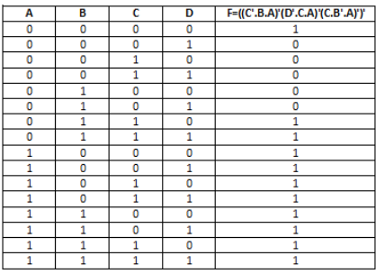
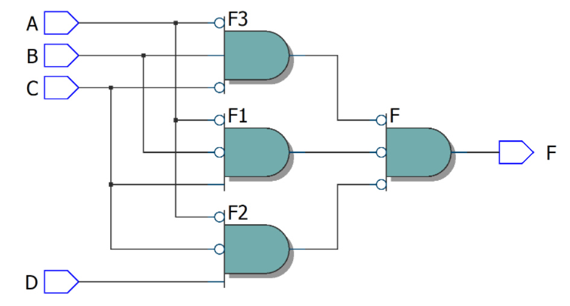
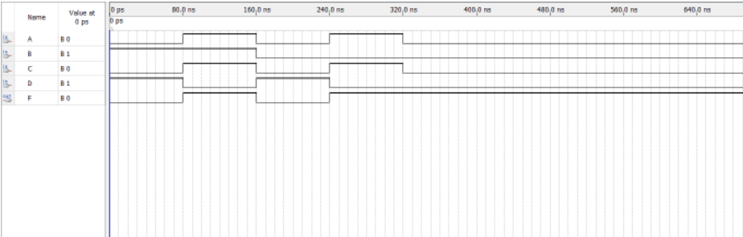
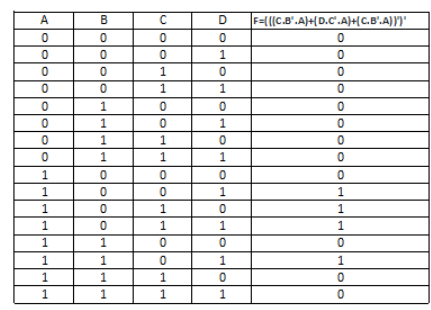
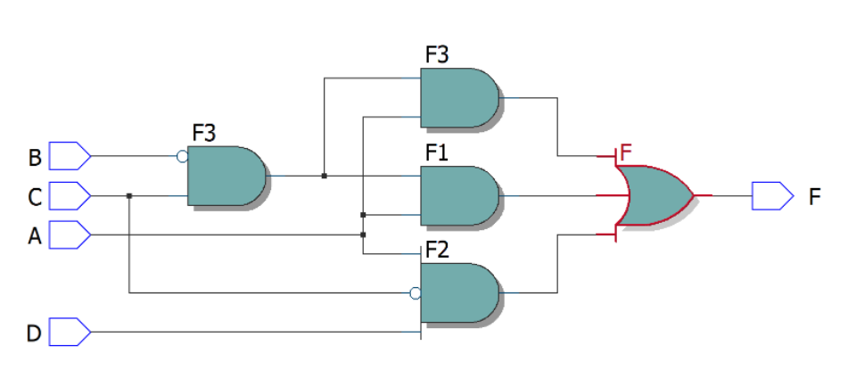
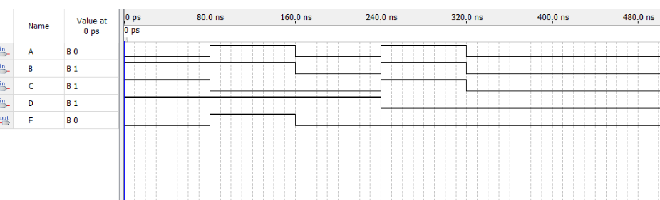

# Experiment--04-Implementation-of-combinational-logic-using-universal-gates-
 ## Implementation-of-Half-subtractor-and-Full-subtractor-circuit
## AIM:
To implement the given logic function using NAND and NOR gates and to verify its operation in Quartus using Verilog programming.
F=((C'.B.A)'(D'.C.A)'(C.B'.A)')' using NAND gate
F=((C'.B.A)'(D'.C.A)'(C.B'.A)')' using NAND gate


## Equipments Required:
Hardware – PCs, Cyclone II , USB flasher Software – Quartus prime
## Theory
 NAND and NOR gates are known as universal gates. They are called universal gates because they can perform all logic functions of OR, AND, and NOT gates.
 
 
 


## Procedure


### Step 1:
Open Quartus II and select new project and choose the file location.

### Step 2:
Module Declaration. Module should have the file name.

### Step 3:
Input-Output Delecaration. F=((C'.B.A)'(D'.C.A)'(C.B'.A)')' using NAND gate F=(((C.B'.A)+(D.C'.A)+(C.B'.A))')' using NOR gate.

### Step 4:
Use assign declaration and wire to define the functionality of logic circuits.

### Step 5:
At the end give endmodule.

### Step 6:
Run the program and choose RTL viewer to get RTL realization.


## Program:
```
/*
Program to design a Implementation of combinational logic using universal gates-  and verify its truth table in quartus using Verilog programming.
Developed by: DHARANI ELANGO
RegisterNumber:  212221230021
*/

F=((C'.B.A)'(D'.C.A)'(C.B'.A)')' using NAND gate

module ex04(A,B,C,D,F);
wire F1,F2,F3;
input A,B,C,D;
output F;
assign F1=(C & ~B & ~A);
assign F2=(D & ~C & ~A);
assign F3=(~C & B & ~A);
assign F=(~F1 & ~F2 & ~F3);
endmodule

F=((C'.B.A)'(D'.C.A)'(C.B'.A)')' using NAND gate


module ex04(A,B,C,D,F);
input A,B,C,D;
output F;
wire F1,F2,F3;
assign F1=(C & ~B &A);
assign F2=(D & ~C & A);
assign F3=(C & ~B & A);
assign F=((F1|F2|F3));
endmodule
```

## Output:
## NAND gate

### Truthtable



### RTL realization


### Timing diagram 

## NOR gate
### Truthtable



###  RTL realization


### Timing diagram 

## Result:
 
Implementation of the given logic function using NAND and NOR gates is done and verification its operation in Quartus using Verilog programming is carried out sucessfully.